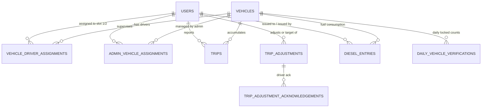

# TripCounter (Tripzoo) — Technical Project Overview, Roadmap & Scaling Architecture

---

## Executive Summary

**TripCounter** is a mission-critical, offline-first fleet operations and trip accounting platform built for commercial transportation and vehicle rental networks (such as **Tripzoo**). 

The platform addresses the operational friction in commercial fleet management:
- **Low/Intermittent Field Connectivity**: Drivers operating in cellular dead-zones can log trips reliably without losing records.
- **Shift & Slot Operations**: Vehicles operate on 12-hour shifts (**Shift 1**: 7:00 AM – 7:00 PM, **Shift 2**: 7:00 PM – 7:00 AM) with dual-driver slot assignments.
- **Auditability & Reconciliation**: Supervisors reconcile reported trips against operational ground truth, record signed adjustments with mandatory audit justifications, record fuel (diesel) dispensing, and lock daily tallies with supervisor sign-off.
- **Multi-Tier Role Governance**: Super Admin, Fleet Admin (Supervisor), and Driver role separations with immutable audit logs.

---

## 1. System Architecture & Tech Stack

```
                                  [ Field Operations / Clients ]
                         ┌───────────────────────────────────────────────┐
                         │   Driver Mobile PWA (Offline-First / IDB)    │
                         │   Admin Dashboard (Reconciliation / Diesel)   │
                         │   Super Admin Portal (Fleet / IAM / Auditing) │
                         └───────────────────────┬───────────────────────┘
                                                 │ HTTPS / WSS
                                                 ▼
                                     [ Reverse Proxy & Edge ]
                         ┌───────────────────────────────────────────────┐
                         │      Nginx (TLS 1.2/1.3, Rate-Limit, Proxy)   │
                         └───────────────────────┬───────────────────────┘
                                                 │
                                                 ▼
                                     [ Application Layer ]
                         ┌───────────────────────────────────────────────┐
                         │  Next.js 16 (App Router) + React 19           │
                         │  • Server Actions & Route Handlers (`/api/*`) │
                         │  • Stateless JWT Auth (HTTP-Only Cookies)     │
                         │  • Shift Engine & Timezone Normalizer         │
                         └───────────────────────┬───────────────────────┘
                                                 │ Pooled Connection (:6543)
                                                 ▼
                                      [ Data & Storage Layer ]
                         ┌───────────────────────────────────────────────┐
                         │   PostgreSQL (Supabase Engine) + Drizzle ORM  │
                         │   • 11 Relational Tables & Enums              │
                         │   • Idempotent Trip Insertion & Audit Logs    │
                         └───────────────────────────────────────────────┘
```

### Technology Matrix

| Layer | Technology | Role & Key Responsibilities |
| :--- | :--- | :--- |
| **Frontend Framework** | Next.js 16.3 (App Router), React 19, TypeScript 5 | Server-rendered dashboards, client-side interactive state, API routes. |
| **Styling & UI** | Tailwind CSS v4, PostCSS | High-contrast mobile UI for drivers (large tap targets, haptic feedback design). |
| **Offline Architecture** | Native PWA (`manifest.json`, `sw.js`), IndexedDB API | Client-side trip buffer during offline operation; auto-sync upon reconnection. |
| **Database & ORM** | PostgreSQL, Drizzle ORM (`drizzle-orm`, `drizzle-kit`) | Strongly typed schema, relational integrity, migrations, and indexed analytics. |
| **Authentication & IAM** | Custom JWT (`jsonwebtoken`), `bcryptjs`, HTTP-Only Cookies | Role-Based Access Control (`SUPER_ADMIN`, `ADMIN`, `DRIVER`), session revocation. |
| **Infrastructure / Gateway** | Nginx, Node.js runtime, PM2 / Docker ready | Reverse proxy, SSL termination, stream buffering bypass for fast delivery. |

---

## 2. Domain Data Model & Relational Schema



The database schema (`src/db/schema.ts`) includes 11 specialized tables:

1. **`users`**: IAM entity supporting `SUPER_ADMIN`, `ADMIN`, and `DRIVER` roles with statuses (`ACTIVE`, `LEAVE`, `INACTIVE`).
2. **`vehicles`**: Tracks vehicle registration numbers and operational status (`ACTIVE`, `BREAKDOWN`, `INACTIVE`).
3. **`vehicle_driver_assignments`**: Temporal assignment log mapping drivers to vehicles into dedicated slots (**Slot 1** vs **Slot 2**) with `startAt` and `endAt`.
4. **`admin_vehicle_assignments`**: Many-to-many relationship enabling supervisors to manage specific subsets of vehicles.
5. **`trips`**: Contains `vehicleId`, `driverId`, `completedAt`, and a unique **`idempotency_key`** (UUID) ensuring zero duplicate entries across offline sync retries.
6. **`trip_adjustments`**: Enables supervisors to record +/- trip corrections with mandatory reason strings.
7. **`trip_adjustment_acknowledgements`**: Tracks when a driver acknowledges an adjustment.
8. **`daily_vehicle_verifications`**: End-of-day supervisor lock storing reported trip count, adjustment sum, verified trip count, notes, and verification status (`UNVERIFIED`, `VERIFIED`).
9. **`diesel_entries`**: Daily fuel issue logging per driver and vehicle (litres, timestamps, notes, supervisor ID).
10. **`notifications`**: System alerts (e.g. adjustments made) with read state.
11. **`audit_logs`**: Immutable event trail capturing all administrative actions, sync events, and alerts.

---

## 3. Core Functional Workflows

### A. Driver Offline-First Workflow
1. **Offline Queuing**: When a driver taps **"Complete Trip"** in a cellular dead zone, the PWA writes an object containing a client-generated UUID `idempotencyKey` and UTC timestamp into client-side **IndexedDB**.
2. **Optimistic UI**: The driver's screen immediately increments today's trip counter with a distinct *"Queued Offline"* status badge.
3. **Automatic Resync**: Browser `online` events trigger a batch POST to `/api/trips/sync`. The server executes a database transaction with `.onConflictDoNothing()` on the unique `idempotency_key`. Synced items are purged from IndexedDB.
4. **Shift Logic**: `src/lib/shifts.ts` dynamically computes the current shift (**Shift 1**: 7:00 AM – 7:00 PM; **Shift 2**: 7:00 PM – 7:00 AM) based on the operational timezone (`Asia/Kolkata`).

### B. Admin Daily Reconciliation & Diesel Logging
1. **Fleet Health**: Dashboard aggregates vehicle statuses, reported trips per driver slot, net adjustments, and verification status across date filters (Today, Yesterday, Week, Month, Custom Range).
2. **Dispute Resolution**: Supervisors add or remove trip counts with audit reasons. This triggers a notification to the affected driver.
3. **Fuel Tracking**: Admins log diesel dispensing directly to the assigned driver and vehicle, providing real-time litres accounting.
4. **Daily Closure**: Admins click **Verify**, which creates a permanent locked snapshot in `daily_vehicle_verifications`.

### C. Super Admin Governance
- Dynamic assignment of vehicle fleets to supervisors.
- Driver onboarding with standardized IDs (e.g. `drv0001` to `drv0030`), phone numbers, and status controls.
- Vehicle fleet inventory management (marking broken-down vehicles immediately locks drivers from submitting trips for that vehicle).
- System-wide immutable audit trail.

---

## 4. Best Fitted Features (Feature Roadmap)

| Feature | Category | Business Value & Implementation Details |
| :--- | :--- | :--- |
| **1. GPS Geofencing & Auto-Trip Logging** | Operations / Automation | Uses browser `navigator.geolocation` or hardware GPS. When a vehicle leaves Depot A and enters Depot B, trip completion is automatically recorded or suggested, minimizing missed taps. |
| **2. Digital Proof of Fueling & Efficiency (Km/L)** | Cost Control | Require photo capture of fuel pump dispenser reading and odometer during diesel logging. Calculate real-time **Km/L** per vehicle and driver to identify fuel theft. |
| **3. Automated Driver Payout & Incentive Engine** | Finance & Payroll | Calculate daily/weekly driver earnings based on completed trips, shift bonuses (e.g. >12 trips/shift = bonus), and diesel penalties. Generates downloadable PDF settlement slips. |
| **4. Live Real-Time Dashboard (WebSockets / SSE)** | Fleet Dispatch | Replace polling with Server-Sent Events (SSE) or WebSockets to push live trip completions, vehicle breakdowns, and verification states to admin dashboards instantly. |
| **5. Multi-Depot / City Tenant Hierarchy** | Enterprise Scaling | Introduce `Hub` / `Depot` entities (`CityId`, `HubId`) so regional managers see only their depot, while headquarters superadmins get pan-regional rollups. |
| **6. WhatsApp Automated Daily Summary** | Driver & Owner Engagement | Use WhatsApp Business API to send shift closure recaps to drivers (trips, diesel, earnings) and nightly operational summaries to vehicle owners. |
| **7. Vehicle Maintenance & Service Alerts** | Preventive Maintenance | Track service intervals based on trip thresholds or days (oil changes, tire rotations, fitness certificates, insurance renewals). |

---

## 5. Distribution & Scaling Strategy

### A. Distribution Strategy (Mobile & Field Access)

1. **Progressive Web App (PWA) via TWA (Trusted Web Activity)**:
   - **Mechanism**: Wrap the existing Next.js PWA using **Bubblewrap / Android TWA** to publish directly to the Google Play Store as a native `.aab` / `.apk`.
   - **Benefits**: Drivers install "Tripzoo" like any native app; updates deploy instantly on the web server without app store review cycles.
2. **Kiosk / MDM Mode for Depot Terminals**:
   - For check-in booths or tablet terminals at fueling stations, distribute via Android Enterprise / MDM locked into the TripCounter web interface.
3. **SMS / WhatsApp Deep-Link Driver Onboarding**:
   - Send one-time login links or WhatsApp magic links for frictionless driver login on their personal devices.

---

### B. High-Volume Scalability Architecture (50 to 50,000+ Vehicles)

```
                            [ DNS / Cloudflare CDN & WAF ]
                                           │
                        ┌──────────────────┴──────────────────┐
                        ▼                                     ▼
             [ Regional Next.js Web/API ]          [ Static Assets / Media ]
             • Stateless Docker Containers         • Cloudflare R2 / S3
             • Auto-scaled on AWS ECS / Fly.io     • Next.js Static Optimization
                        │
                        ▼
             [ Caching & Ephemeral Layer ]
             • Redis (Upstash / DragonFly)
               - Session cache & rate limiting
               - Real-time pub/sub for admin updates
                        │
                        ▼
             [ Primary PostgreSQL Database ]
             • PgBouncer Connection Pooling (Port 6543)
             • Read Replica for heavy Admin/Analytical Reports
             • Time-based Table Partitioning for `trips` (by month)
```

#### 1. Database Partitioning & Archival
- At scale (e.g. 1,000 vehicles × 20 trips/day = 7.3 million rows/year), implement **PostgreSQL declarative table partitioning by range (`completedAt` by month)**.
- Query plans automatically prune partitions when filtering by `startDate` and `endDate`.

#### 2. Redis Caching Layer
- Cache aggregated shift and daily vehicle tallies in Redis with a short TTL (e.g. 30 seconds).
- Admin dashboard queries read from cache rather than running multi-join SQL aggregations on every page refresh.

#### 3. Database Connection Pooling
- Continue utilizing transaction-mode connection poolers (PgBouncer on port `6543`) to shield PostgreSQL from connection exhaustion during shift handover peak windows (7:00 AM and 7:00 PM).

#### 4. Asynchronous Background Workers
- Offload long-running tasks (monthly payroll calculations, CSV/Excel fleet exports, audit log dumps, WhatsApp dispatch) to background workers using **BullMQ + Redis** or serverless step functions.

#### 5. Containerized Edge & Cloud Deployment
- Build using `output: 'standalone'` in Next.js.
- Run lightweight Docker images on auto-scaling container services (AWS ECS Fargate, GCP Cloud Run, or Kubernetes) behind Cloudflare WAF for DDoS protection, HTTP/3 delivery, and edge TLS termination.
